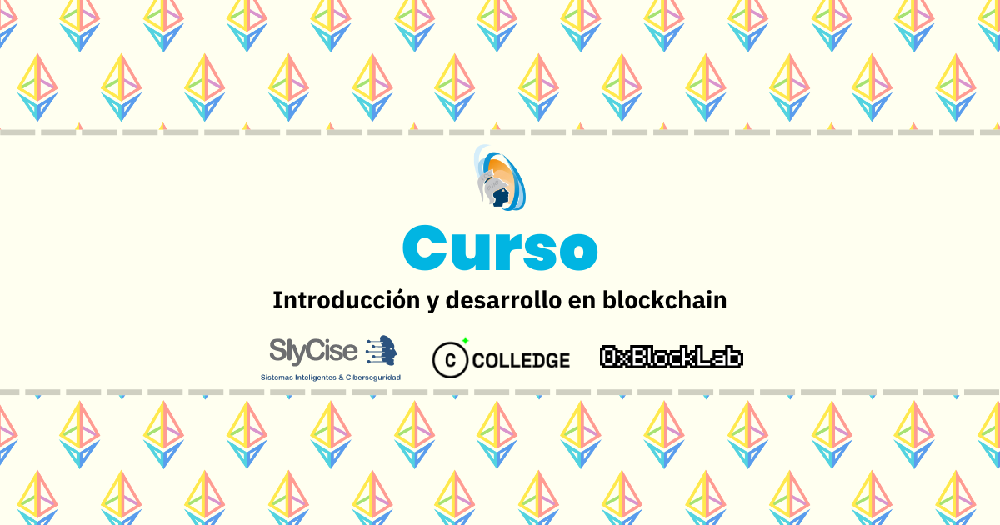

En este repositorio encontrarás documentos, códigos y material variado relacionado con el curso "Introducción y Desarrollo en Blockchain" impartido por 0xBlockLab y Colledge. 

El repositorio esta ordenado de la siguiente manera

    .
    ├── 📁 assets_README
    ├── 📁 Codigo
    ├── 📁 Presentaciones
    └── README.md
